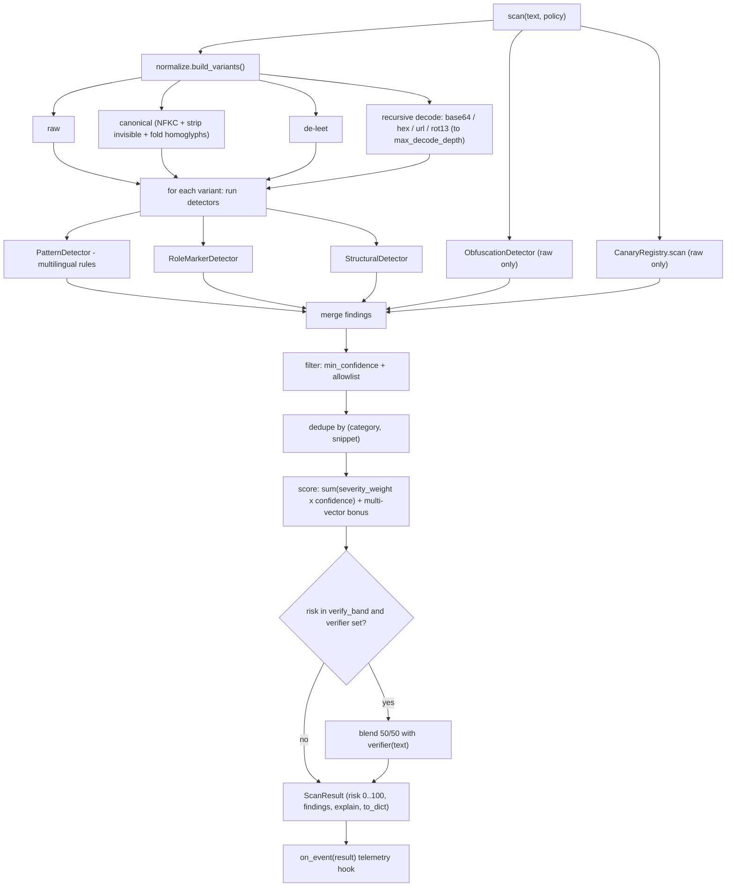
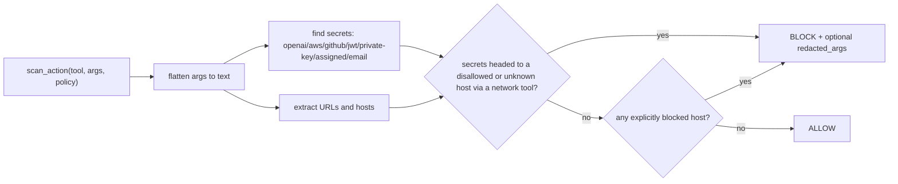

# Architecture

`cordon` is a small, dependency-free engine with a clear pipeline and clean
extension points. This document explains how a scan flows through the system
and how to extend each stage.

## Modules

```
cordon/
  models.py      Finding, ScanResult (shared data types)
  normalize.py   variant building: NFKC, confusable folding, de-leet,
                 invisible stripping, recursive base64/hex/url/rot13 decode
  rules.py       Rule dataclass + the multilingual pattern catalog + role markers
  detectors.py   PatternDetector, RoleMarkerDetector, StructuralDetector,
                 ObfuscationDetector
  canary.py      CanaryRegistry: secret/canary tripwires
  scanner.py     orchestration + scoring + optional verifier  (scan)
  sanitize.py    sanitize, spotlight, wrap_as_data, build_context, Trust, guard
  egress.py      outbound action firewall  (scan_action) + secret redaction
  mcp.py         guard_tool_result, cordon_tool  (MCP/tool boundary helpers)
  cli.py         scan / sanitize / scan-action
```

## Inbound scan pipeline



### Why variants

A raw-text matcher is trivially bypassed. `cordon` generates several
*views* of the same input and runs every detector against each:

- **canonical** — `unicodedata.NFKC`, strip zero-width/bidi characters, fold
  Cyrillic/Greek/fullwidth homoglyphs back to ASCII. Defeats `іgnоre`.
- **de-leet** — map `0->o 1->i 3->e 4->a 5->s 7->t @ $ !`. Defeats `1gn0re`.
- **decoded** — find base64/hex blobs and percent-encoding, decode anything
  that looks like text, and **recurse** so a payload encoded twice still
  surfaces. rot13 is also tested. Each decoded view is tagged with its layer
  (e.g. `base64:base64`) so the `Finding.hidden` flag and the report can show
  *where* the payload was buried.

Findings discovered in a derived (decoded/obfuscated) layer get a small
confidence boost, since hiding a payload is itself evidence of intent.

## Scoring

Each finding contributes `severity_weight[severity] * confidence`:

| severity | 1 | 2 | 3 | 4 | 5 |
|---|---|---|---|---|---|
| weight | 5 | 10 | 18 | 30 | 45 |

A multi-vector bonus adds `5 * (distinct_categories - 1)`, because several
independent attack types appearing together is far more convincing than one.
The total weight is squashed to 0..100 with `100 * (1 - 1/(1 + weight/30))`,
calibrated so a single critical pattern at full confidence reaches 60 (the
`dangerous` line). Thresholds (`suspicious`, `dangerous`) are policy-driven.

## Outbound firewall (`scan_action`)



This is the half most tools ignore: even if an injection slips through inbound
scanning, the firewall can still stop the agent from exfiltrating data.

## Extension points

- **Add a rule:** append a `Rule(...)` to `RULES` in `rules.py` (set
  `category`, `severity`, `confidence`, optional `lang`). Add a test.
- **Add a detector:** create a class with `name` and
  `detect(text, layer) -> list[Finding]`, and register it in
  `scanner.scan()`. Detectors are independent and composable.
- **Add a secret shape:** add a pattern to `SECRET_PATTERNS` in `egress.py`.
- **Tune behavior without code:** construct a `Policy` (thresholds, decode
  depth, allowlist, domains, verifier, telemetry). No fork required.
- **Second-stage model:** set `Policy.verifier` to any
  `Callable[[str], float]`. It is only invoked for gray-zone risk, keeping the
  common path fast and offline.

## Design principles

1. **Zero dependencies.** Standard library only. Easy to audit, trivial to vendor.
2. **Heuristics are honest.** Every finding has a severity and confidence, and
   the result explains itself. `cordon` never claims certainty.
3. **Fast by default, smart on demand.** Regex/heuristics run offline in
   sub-millisecond time; the optional LLM verifier is reserved for ambiguity.
4. **Both directions.** Guarding input alone is incomplete; the egress firewall
   is a first-class part of the design.
